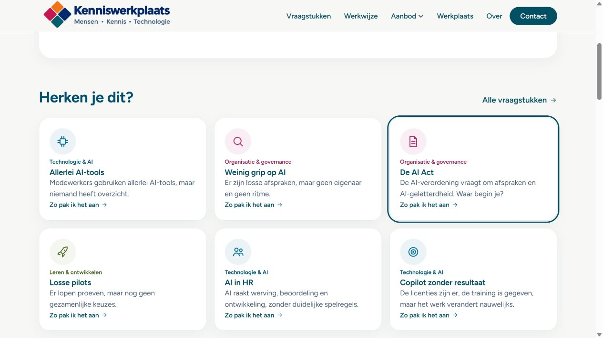
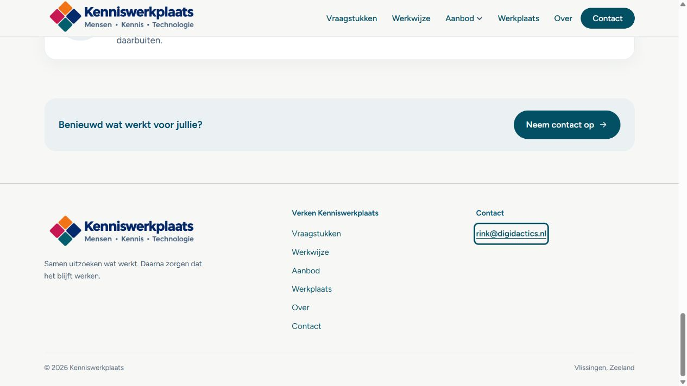

# Controle kleursysteem

Branch: `kleursysteem`, vanaf `main` op commit `4480660`. Geen PR gemerged en geen productiedeployment gestart.

## Beoordeling en keuzes

De oorspronkelijke CSS definieerde meerdere paletten na elkaar. Vraagstukkleuren werden afgeleid uit de groep van hun bestemming. Hierdoor kreeg governance over AI hetzelfde magenta als AI-technologie en kreeg Samenwerken de leerkleur van het Praktijklab. De nieuwe domeinvelden leggen de inhoudelijke kleurrol afzonderlijk vast.

Magenta is nu organisatie/governance, blauw technologie/AI en groen leren/ontwikkeling. Alle drie hebben een lichte tint en donkere tekstvariant. Knoppen, links en focus blijven petrol; gewone koppen en tekst zijn marine. De redactionele groepen, teksten, casefeiten, verwijzingen en bewijsstatussen blijven behouden.

De AI Act en Weinig grip op AI zijn als governancevraagstukken ingedeeld bij `org`; AI op Orde ook. Copilot blijft als vraagstuk `tech`, terwijl AI-bekwaamheid als dienst `leren` is. Evaluatie- en borgingsonderwerpen zijn `org`, ook als het om platforms gaat. De volledige mapping staat in `docs/design-system.md`.

De voorgestelde basiskleur groen haalt 3,13:1 op wit en onvoldoende 3:1 op de groene tint. Daarom gebruiken groene tekst én lijniconen `--leren-ink`. Oranje krijgt geen UI-token; achtergrondkunst wordt in grijstinten getoond. Het bestaande logo, de favicon, de homepage-illustratie en de vijf AISA-kaarten blijven als beeld behouden. De hero is wit en de banner lichtgroen.

## Verificatie

- `npm run build`: geslaagd; alle 22 routes gebouwd en ingebouwde data/linkcontroles geslaagd.
- `npm run check`: geslaagd; 9 aanbodonderdelen, 15 cases en 11 vraagstukken, inclusief verplichte geldige domeinvelden.
- `git diff --check`: geslaagd.
- De drie datalijsten zijn programmatisch met `main` vergeleken na het weglaten van uitsluitend de nieuwe kleurvelden: alle oorspronkelijke velden zijn exact gelijk.
- Browser: alle 22 routes op desktop en 360px; daarnaast het desktopmenu, uitgeklapt mobiel menu en alle 15 dialogs op beide breedtes. 76 pagina-/componenttoestanden; geen horizontale scroll.
- Contrast: 8.964 gerenderde tekst-/icoonmetingen, samengevoegd tot unieke combinaties per toestand; daarnaast 65 vaste token- en decoratiecombinaties en beide gradientuiteinden uit het historische paletvoorbeeld. Geen fouten.
- Minimaal normale tekst: 4,74:1 (inclusief conservatieve decoratieberekening). Minimaal grote tekst: 7,85:1. Minimaal icoon: 4,77:1. Grenzen: 4,5:1 normale tekst en 3:1 grote tekst/iconen.
- Domeiniconen op eigen tint: org 5,31:1; tech 5,12:1; leren 5,91:1.
- Historische voorbeelden zijn meegecontroleerd: te lichte lege fasecirkels hersteld; de oude banner licht gemaakt om een botsing met de nieuwe tekstkleuren te voorkomen. Zij behouden verder hun eigen vergelijkingspaletten.

Reproduceerbaar zonder extra dependencies:

```sh
node scripts/check-contrast.mjs
node scripts/check-contrast.mjs docs/reviews/kleursysteem/contrast-observaties.json
```

`contrast-observaties.json` bevat per browsertoestand unieke kleurcombinaties met hun tellingen; `contrast-resultaten.json` bevat de uitkomsten. De browsercollectie leest de DOM met de geëxporteerde functie `collectContrast()` via de browsertool. Transparantie wordt met de ouderachtergrond samengesteld. De rand van een bewijsstip wordt met de achtergrond eromheen vergeleken. Gradientuiteinden worden afzonderlijk gecontroleerd; grijze achtergrondkunst wordt conservatief doorgerekend met zwart op de maximale opacity.

Deze kleurcontrole omvat functionele HTML-tekst en iconen. Logo's en rasterillustraties vallen buiten deze berekeningen; dit is geen volledige toegankelijkheidsaudit.

## Screenshots van de gebouwde site

[Homepage desktop](homepage-desktop.jpg) · [Aanbod desktop](aanbod-desktop.jpg) · [Homepage 360px](homepage-360.jpg) · [Aanbod 360px](aanbod-360.jpg)



## Vervolg: footer

De footer heeft drie rustige kolommen, een verticale navigatielijst met alle zes bestaande links, logo en slogan dichter bij elkaar, en een onderste regel met het buildjaar, de bestaande merknaam en de bestaande locatie. De bovenlijn blijft zichtbaar. De semantische footer-navigatie heeft een eigen toegankelijke naam. De CSS voor de standaardfooter staat nu op één plek. Op mobiel worden de kolommen gestapeld en krijgen links ruimere klikvlakken. Geen nieuwe locatie of contactgegevens overgenomen uit de voorbeeldtekst.

Build en ingebouwde controles geslaagd; opnieuw gecontroleerd op desktop en 360px, zonder contrastfouten of horizontale scroll. Deze twee aanvullende browsertoestanden zijn toegevoegd aan de meetgegevens. De volledige pagina-screenshots zijn vernieuwd.



[Footer op mobiel: volledige homepage](homepage-360.jpg)
